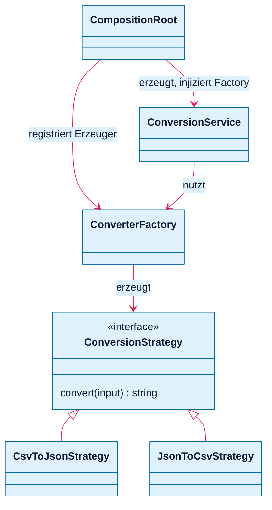

# Klassendiagramm (MVP, minimal)

Nur die Kernstruktur. Siehe [architecture.md](architecture.md) und [decisions.md](decisions.md).

- **Strategy:** `ConversionStrategy` mit zwei konkreten Richtungen.
- **Factory:** `ConverterFactory` erzeugt die Strategy für (Quelle, Ziel) aus registrierten Erzeugern.
- **DI:** Die `CompositionRoot` verdrahtet alles; `ConversionService` bekommt die Factory per Konstruktor.

Weggelassen: API-Route, `FormatDetector`, `Format`, Domain-Fehler.
